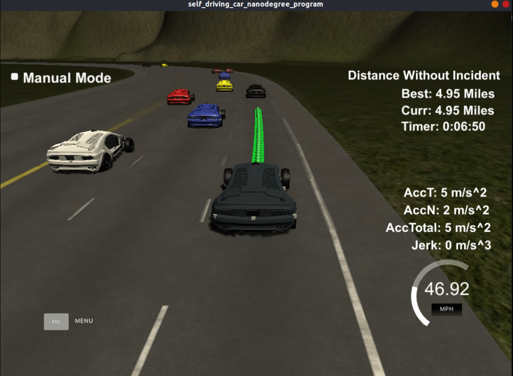

# Path-Planning-Project


## Overview:

In this project, I will be implementing a path planning algorithm to drive a car in a highway scenario. For this I will be using a simulator provided by [udacity](https://github.com/udacity/self-driving-car-sim/releases/tag/T3_v1.2). This simulator sends car's information such as position and velocity and sensor fusion information about the rest of the cars in the scenario. The communicaiton between the simulator and the code for path planner is done using [Websocket](https://en.wikipedia.org/wiki/WebSocket).


## Goals:
In this project my goal is to safely navigate around a virtual highway with other traffic that is driving +-10 MPH of the 50 MPH speed limit. I have being provided the car's localization and sensor fusion data, there is also a sparse map list of waypoints around the highway. The car should try to go as close as possible to the 50 MPH speed limit, which means passing slower traffic when possible, note that other cars will try to change lanes too. The car should avoid hitting other cars at all cost as well as driving inside of the marked road lanes at all times, unless going from one lane to another. The car should be able to make one complete loop around the 6946m highway. Since the car is trying to go 50 MPH, it should take a little over 5 minutes to complete 1 loop. Also the car should not experience total acceleration over 10 m/s^2 and jerk that is greater than 10 m/s^3.

### The map of the highway is in data/highway_map.txt
Each waypoint in the list contains  [x,y,s,dx,dy] values. x and y are the waypoint's map coordinate position, the s value is the distance along the road to get to that waypoint in meters, the dx and dy values define the unit normal vector pointing outward of the highway loop.

The highway's waypoints loop around so the frenet s value, distance along the road, goes from 0 to 6945.554.

## Basic Build Instructions:

1. Clone this repo.
2. Make a build directory: `mkdir build && cd build`
3. Compile: `cmake .. && make`
4. Run it: `./path_planning`.

Here is the data provided from the Simulator to the C++ Program

#### Main car's localization Data (No Noise):

["x"] The car's x position in map coordinates

["y"] The car's y position in map coordinates

["s"] The car's s position in frenet coordinates

["d"] The car's d position in frenet coordinates

["yaw"] The car's yaw angle in the map

["speed"] The car's speed in MPH

#### Previous path data given to the Planner:

//Note: Return the previous list but with processed points removed, can be a nice tool to show how far along
the path has processed since last time. 

["previous_path_x"] The previous list of x points previously given to the simulator

["previous_path_y"] The previous list of y points previously given to the simulator

#### Previous path's end s and d values: 

["end_path_s"] The previous list's last point's frenet s value

["end_path_d"] The previous list's last point's frenet d value

#### Sensor Fusion Data, a list of all other car's attributes on the same side of the road. (No Noise)

["sensor_fusion"] A 2d vector of cars and then that car's [car's unique ID, car's x position in map coordinates, car's y position in map coordinates, car's x velocity in m/s, car's y velocity in m/s, car's s position in frenet coordinates, car's d position in frenet coordinates. 

## Details:

1. The car uses a perfect controller and will visit every (x,y) point it recieves in the list every .02 seconds. The units for the (x,y) points are in meters and the spacing of the points determines the speed of the car. The vector going from a point to the next point in the list dictates the angle of the car. Acceleration both in the tangential and normal directions is measured along with the jerk, the rate of change of total Acceleration. The (x,y) point paths that the planner recieves should not have a total acceleration that goes over 10 m/s^2, also the jerk should not go over 50 m/s^3. Also currently jerk is over a .02 second interval, it would probably be better to average total acceleration over 1 second and measure jerk from that.

2. There will be some latency between the simulator running and the path planner returning a path, with optimized code usually its not very long maybe just 1-3 time steps. During this delay the simulator will continue using points that it was last given, because of this its a good idea to store the last points you have used so you can have a smooth transition. previous_path_x, and previous_path_y can be helpful for this transition since they show the last points given to the simulator controller with the processed points already removed. You would either return a path that extends this previous path or make sure to create a new path that has a smooth transition with this last path.


## Rubic Points:

### Compilation:

#### The code compiles correctly.
No changes were made in the cmake configuration. A new file was added src/spline.h. It is the Cubic Spline interpolation implementation in a single header file. This was suggested during classroom QA season which was very useful!

### Valid Trajectory:

The car was able to drive around the given track of around 5 miles without any warnings or collisions. Simulation was kept for almost 10 mins, below are few screenshots during test runs,




### Speed Limits:

During the test run, which was around 10 mins, no speed limit violation was detected.

### Max. acceleration and jerk limits:

The car does not exceed the max limits for acceleration of 10 m/s^2 and a jerk of 10 m/s^3.

### Collision:

The car didn't collide with other road vehicles during the test duration.

### The car stays in its lane, except for the time between changing lanes:

The car didn't violated lane discipline, it didn't spend more than a 3 second length out side the lane lanes during changing lanes, and every other time the car stays inside one of the 3 lanes on the right hand side of the road.

### The car is able to change lanes:

The car was able to smoothly change lanes when it makes sense to do so, such as when behind a slower moving car and an adjacent lane is clear of other traffic.

## Reflection:

Based on the provided code, the path planning algorithm starts at src/main.cpp. The code could be seprated into different functions to show the overall process, but was preferred to have everything in a single place to aviod jumping to different parts of the files which create unnecessary complixity. Comments have been provided to improve the code readability throughout the code.

Code consists of 3 parts:

##### Prediction:

This part of the code deals with the position, velocity (of ego vehicle) and sensor fusion data. It intends to reason about the environment. Following are the points lookout to be captured by this block of code:

* Is there a car in front of the ego vehicle?
* Is ther a car to the right of ego vehicle for making a lane change?
* Is ther a car to the left of ego vehicle for making a lane change?

These questions are answered by calculating the lane each other car is and the position it will be at the end of the last planned trajectory. A car is marked dangerous when its distance to ego vehicle is less than 30 meters in front or behind us.

##### Behavior:

This part decides what should be the behaviour of ego vehicle to sensed prediction. This part tries to answer following questions:

* If ther is a vehicle in front of us, do ego vehicle change lane?
* Does ego vehicle need to speed up or slow down?

Based on the prediction of the situation we are in, this code increases the speed, decrease speed, or make a lane change when it is safe. Instead of increasing the speed at this part of the code, a speed_diff is created to be used for speed changes when generating the trajectory in the last part of the code. This approach makes the car more responsive acting faster to changing situations like a car in front of it trying to apply brake to cause a collision.

##### Trajectory:

This code does the calculation of the trajectory based on the speed and lane output from the behavior, car coordinates past path points.

First, the last two calculation of the previous trajectory or the car position if there are no previous trajectory. As used in conjunction three points at a far distance to initialize the spline calculation. To make the work less complicated to the spline calculation based on those points, the coordinates are transformed to local car coordinates.

In order to ensure more continuity on the trajectory, the pass trajectory points are copied to the new trajectory. The rest of the points are calculated by evaluating the spline and transforming the output coordinates to non local coordinates. The speed change is decided on the behavior part of the code, but it is used in that part to increase/decrease speed on every trajectory points instead of doing it for the complete trajectory.

## Future Improvements:

The implementation of the path planning algorithm worked pretty well. For future enhancements of the code, I would like to structure the code with proper structure for different section of functions. Also, it would be intresting to check the implementation of state chart for behavior planning and the evaluation of different behaviours and trajectories based on cost functions would improve the code of the path planner.

## Tips:

A really helpful resource for doing this project and creating smooth trajectories was using http://kluge.in-chemnitz.de/opensource/spline/, the spline function is in a single hearder file is really easy to use.

---

## Dependencies:

* cmake >= 3.5
  * All OSes: [click here for installation instructions](https://cmake.org/install/)
* make >= 4.1
  * Linux: make is installed by default on most Linux distros
  * Mac: [install Xcode command line tools to get make](https://developer.apple.com/xcode/features/)
  * Windows: [Click here for installation instructions](http://gnuwin32.sourceforge.net/packages/make.htm)
* gcc/g++ >= 5.4
  * Linux: gcc / g++ is installed by default on most Linux distros
  * Mac: same deal as make - [install Xcode command line tools]((https://developer.apple.com/xcode/features/)
  * Windows: recommend using [MinGW](http://www.mingw.org/)
* [uWebSockets](https://github.com/uWebSockets/uWebSockets)
  * Run either `install-mac.sh` or `install-ubuntu.sh`.
  * If you install from source, checkout to commit `e94b6e1`, i.e.
    ```
    git clone https://github.com/uWebSockets/uWebSockets 
    cd uWebSockets
    git checkout e94b6e1
    ```
